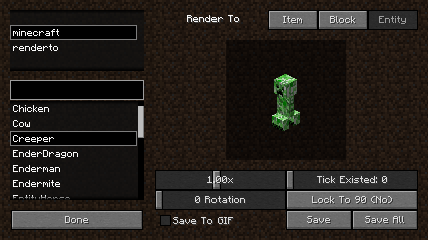
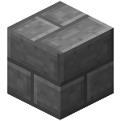
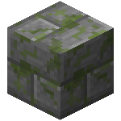
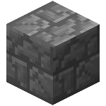
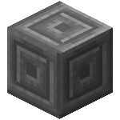
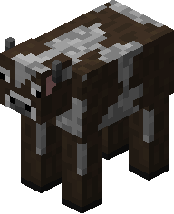
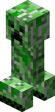
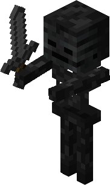

Render To
====

RenderTo is a [MinecraftForge](http://files.minecraftforge.net/) mod used to generate
well-rendered item, block and entity pictures, These pictures can be used in mod wiki sites, 
presenting mod item, block and mobs, just like [Official Minecraft Wiki]
(http://minecraft.gamepedia.com/) does.

## Download & Installation
Latest Release: [RenderTo-0.4.0.jar](https://github.com/herbix/renderTo/raw/master/build/libs/RenderTo-0.4.0.jar)

RenderTo can be installed in the same way as other mods by putting "RenderTo-x.x.x.jar" into
"mods" directory.

## Usage
Create a world in single player, make sure you are in creative mode or cheating is enabled. You
could find a "Render To" item in creative mode inventory, or acquire it by command:
```
/give <your name> renderto:render_to
```
Hold "Render To", right click to open render to GUI.



First, select a mod in left-top list. Then choose what to render by click right-top buttons.
Left-bottom list would refresh if you change mod or render type. Left-middle textfield is a filter
of the following list, which supports regular expressions. Choose an item for rendering in
it and finally a preview is shown in the middle canvas. Click "Save", and the rendered picture
would be stored in
```
.minecraft/RenderTo/<modid>/<render type>/<size>/<item/block/entity name>.png
```
or
```
.minecraft/RenderTo/<modid>/<render type>/<size>/<item/block/entity name>.gif
```
, depending on whether "Save To GIF" is selected.

Also, clicking "Save All" would save all items in left-bottom list. It would cost much time and
Minecraft won't response your input during it. Wait for it and it would finish after all.

For item type rendering, change "Image Size" textfield would change the output picture size.

For block type rendering, the model could rotate, and change "Image Size" textfield would change the output picture size.

For entity type rendering, the model could rotate and scale.

## Gallery





## Develop & Contribute
You could fork this repository in github, or clone it from github:
```
> git clone https://github.com/herbix/renderTo.git
```
Do same thing as installing MinecraftForge and developing environment is built:
```
> gradlew setupDecompWorkspace eclipse
```

Anyone could contribute to RenderTo by creating a pull request. I would appreciate you if you make
it better.

## License
RenderTo is in [GPL2](LICENSE) license.
